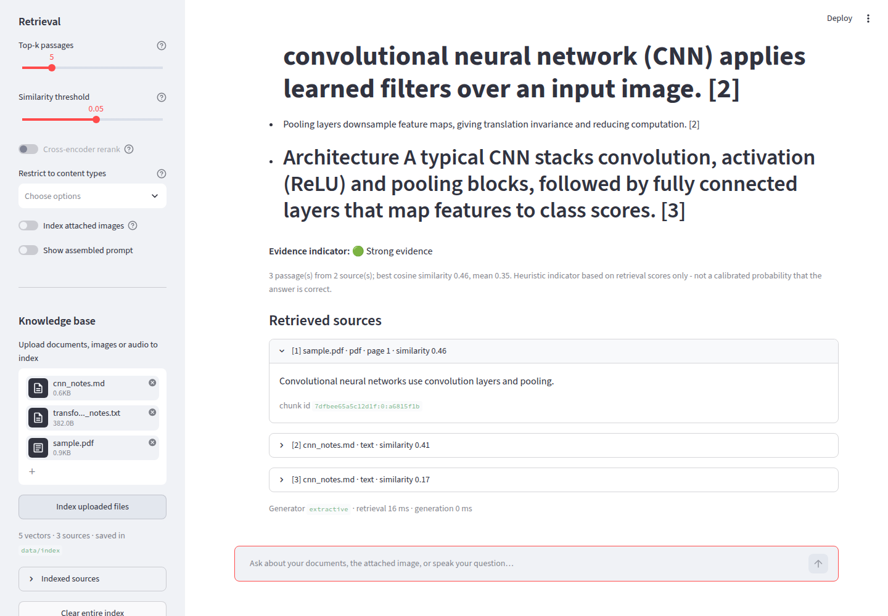
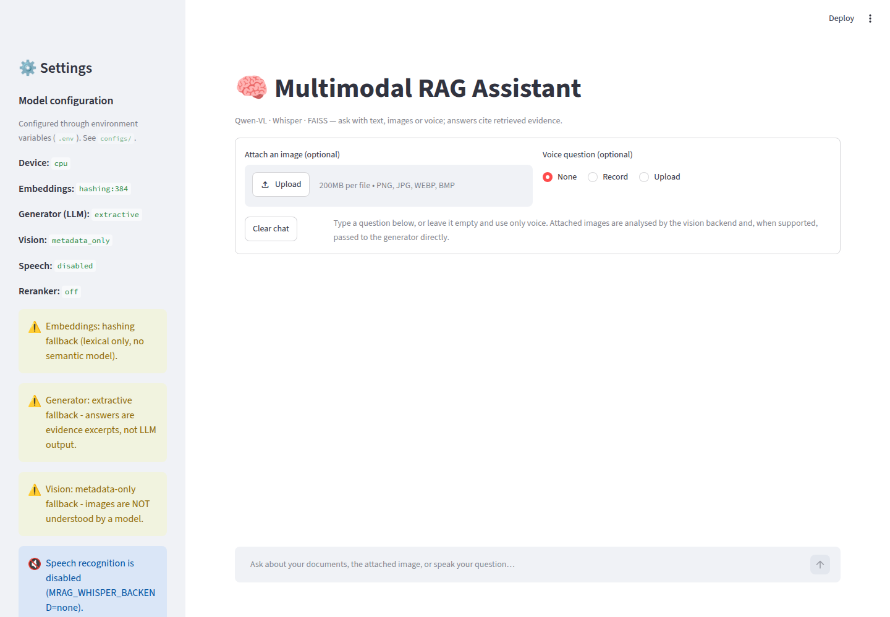

# Multimodal RAG Assistant

**Qwen-VL + Whisper + FAISS retrieval-augmented generation over text, images and voice.**

Ask a question by typing it, speaking it, or attaching an image (a document scan, a
diagram, a chart, a screenshot). The assistant transcribes speech with Whisper, reads
images with Qwen-VL, retrieves the most relevant chunks of your indexed documents from
FAISS, and answers with a language model that is instructed to cite evidence and to say
when the evidence is insufficient. Every answer shows the retrieved sources, their
similarity scores and a heuristic evidence indicator, so the RAG process is transparent.

[](https://github.com/khushbooshaurya5/Multimodal-RAG-Assistant/actions/workflows/ci.yml)




*Streamlit UI running in the offline profile: the answer, the evidence indicator and the
retrieved sources with page numbers and similarity scores. (Screenshot uses the extractive
fallback, hence the warning banner; with Qwen-VL configured the answer is model-generated.)*

> **Live demo:** [huggingface.co/spaces/khushbook1202/multimodal-rag-assistant](https://huggingface.co/spaces/khushbook1202/multimodal-rag-assistant)
> (CPU Space; the first request after a cold start downloads the models). Deploy your own copy with
> `python scripts/deploy_hf_space.py`, see [Deploying a live demo](#deploying-a-live-demo).

---

## Contents

- [Features](#features)
- [Architecture](#architecture)
- [Tech stack](#tech-stack)
- [Installation](#installation)
- [Configuration](#configuration)
- [Running](#running)
- [Deploying a live demo](#deploying-a-live-demo)
- [Example workflows](#example-workflows)
- [Design decisions](#design-decisions)
- [Evaluation](#evaluation)
- [Testing](#testing)
- [Project structure](#project-structure)
- [Limitations](#limitations)
- [Future improvements](#future-improvements)

## Features

| Area | What it does |
| --- | --- |
| **Inputs** | Text questions, image uploads, voice (browser recording or WAV/MP3/FLAC/M4A upload), and any combination. |
| **Speech** | Whisper (Hugging Face `transformers`) with chunked long-form decoding, segment timestamps and language detection. Audio is decoded with `soundfile`, mixed to mono and resampled to 16 kHz without extra dependencies; `ffmpeg` is used for M4A/AAC when present. |
| **Vision** | Qwen2-VL / Qwen2.5-VL produce a *structured* analysis per image: type (document / diagram / chart / table / screenshot / photo), dense description, verbatim visible text and objects. That structure becomes searchable text. |
| **Ingestion** | TXT/MD/PDF (with page numbers), images (VLM analysis) and audio (transcripts with timestamps) go through one pipeline: extract → chunk → embed → FAISS. |
| **Chunking** | Sentence-aware, overlap-carrying chunker; audio chunks keep start/end seconds, PDF chunks keep page numbers. |
| **Vector store** | `FaissVectorStore` (`add / search / save / load / remove`) on `IndexIDMap2(IndexFlatIP)` with a JSONL metadata sidecar and a manifest. Nothing is lost on restart; a store built with one embedder refuses to be queried with another. |
| **Retrieval quality** | Configurable top-k, cosine threshold, metadata filters (modality / file), near-duplicate removal, optional cross-encoder reranking. |
| **Grounded generation** | Numbered evidence in the prompt, citations in the answer, explicit "insufficient evidence" behaviour, image passed to the model directly when it supports vision. |
| **Transparency** | Every response carries citations (source, page / timestamp, chunk id, score), an evidence indicator (heuristic, explicitly *not* a calibrated probability), the transcript and the image analysis. |
| **Swappable backends** | Each model role is chosen with an environment variable: local `transformers`, an OpenAI-compatible endpoint (vLLM / Ollama / DashScope), or a clearly labelled offline fallback. |
| **Interfaces** | Streamlit UI, FastAPI server, CLI scripts. |
| **Quality** | 99 unit + integration tests, ruff, GitHub Actions CI, evaluation script with a committed baseline report. |

## Architecture

```
User
 │
 ▼
Input Layer ───────────────── app/ (Streamlit) · src/api (FastAPI) · scripts/
 ├── Text
 ├── Image
 └── Audio
 │
 ▼
Preprocessing
 ├── Whisper  → speech-to-text (timestamps, language)     src/audio
 ├── Qwen-VL  → structured image understanding            src/vision
 └── Text / PDF extraction + sentence-aware chunking      src/text
 │
 ▼
Embedding Layer  (sentence-transformers | hashing fallback)   src/embeddings
 │
 ▼
FAISS Vector Database + JSONL metadata store                 src/vectorstore
 │
 ▼
Retriever  (top-k · threshold · filters · dedup · rerank)    src/retrieval
 │
 ▼
Context Assembly  (numbered evidence + transcript + image)   src/rag/context.py
 │
 ▼
Qwen-VL / LLM  (transformers | OpenAI-compatible | extractive fallback)   src/rag/generator.py
 │
 ▼
Grounded Response  =  Answer + Citations + Evidence indicator
```

`src/models/` only loads weights and builds clients; the business logic in
`src/audio`, `src/vision`, `src/rag` depends on small `Protocol` interfaces, which is
what makes every backend swappable and every layer testable in isolation.
See [`docs/ARCHITECTURE.md`](docs/ARCHITECTURE.md) for the layer-by-layer description.

### Query flow (multimodal)

1. **Audio** → Whisper transcript. The transcript is appended to the typed question (or *is* the question).
2. **Image** → Qwen-VL structured analysis. Its visible text and description are appended to the *retrieval query* so that documents related to the image surface; optionally the analysis is added to the index.
3. **Retrieval** → query embedding → FAISS top-k·3 → threshold → filters → dedup → (rerank) → top-k.
4. **Context assembly** → evidence passages numbered `[1]…[n]` with source / page / timestamp / score, plus the transcript and image analysis, under a character budget.
5. **Generation** → Qwen-VL receives the prompt (and the image itself when the backend supports vision) with grounding rules.
6. **Response** → answer, citations, evidence indicator, per-stage latency.

## Tech stack

Python 3.11 · PyTorch · Hugging Face Transformers (Whisper, Qwen2-VL / Qwen2.5-VL) ·
sentence-transformers (MiniLM embeddings, optional cross-encoder reranker) · FAISS ·
Pydantic v2 + pydantic-settings · NumPy · soundfile · Pillow · pypdf · FastAPI · Streamlit ·
httpx · python-dotenv · pytest · ruff · Docker.

## Installation

```bash
git clone https://github.com/khushbooshaurya5/Multimodal-RAG-Assistant.git
cd Multimodal-RAG-Assistant
python -m venv .venv && source .venv/bin/activate

# CPU-only torch (skip this line on a CUDA machine to get the default GPU build)
pip install --index-url https://download.pytorch.org/whl/cpu torch

pip install -r requirements.txt          # or requirements-dev.txt for tests + lint
cp configs/default.env .env              # pick a profile, then edit as needed
python scripts/download_models.py        # optional: pre-fetch weights into the HF cache
```

Optional system packages: `ffmpeg` (M4A/AAC decoding and MP3 on old libsndfile builds).

### Docker

```bash
docker build -t multimodal-rag-assistant .
docker run -p 8501:8501 -v $PWD/data:/app/data -v hf-cache:/models_cache --env-file .env multimodal-rag-assistant
```

## Configuration

All settings are environment variables with the `MRAG_` prefix, loaded from `.env` by
`src/config.py` (single source of truth). Three ready-made profiles live in `configs/`:

| Profile | Embeddings | Speech | Vision | Generation | When |
| --- | --- | --- | --- | --- | --- |
| `default.env` | MiniLM | Whisper-small | Qwen2-VL-2B (local) | Qwen2-VL-2B (local) | GPU or patient CPU, Hugging Face reachable |
| `openai_compatible.env` | MiniLM | Whisper-small | Qwen2-VL-7B via API | Qwen2-VL-7B via API | Qwen-VL served by vLLM / Ollama / DashScope |
| `offline.env` | hashing (lexical) | disabled | metadata only | extractive | No downloads possible (CI, air-gapped). **No neural model involved; the UI says so.** |

Key variables (full list with comments in [`.env.example`](.env.example)):

| Variable | Default | Meaning |
| --- | --- | --- |
| `MRAG_DEVICE` | `auto` | `auto` → CUDA if available, else MPS, else CPU. |
| `MRAG_FALLBACK_ON_ERROR` | `true` | If a neural backend fails to load, start with the offline fallback and show the error instead of crashing. |
| `MRAG_EMBEDDING_BACKEND` / `MRAG_EMBEDDING_MODEL` | `sentence_transformers` / `all-MiniLM-L6-v2` | `hashing` is the offline fallback. |
| `MRAG_WHISPER_BACKEND` / `MRAG_WHISPER_MODEL` / `MRAG_WHISPER_LANGUAGE` | `transformers` / `openai/whisper-small` / auto | `none` disables audio. |
| `MRAG_VISION_BACKEND` / `MRAG_VISION_MODEL` | `transformers` / `Qwen/Qwen2-VL-2B-Instruct` | `openai_compatible` or `metadata`. |
| `MRAG_LLM_BACKEND` / `MRAG_LLM_MODEL` | `transformers` / `Qwen/Qwen2-VL-2B-Instruct` | `openai_compatible` or `extractive`. Same model name as vision ⇒ weights are shared. |
| `MRAG_OPENAI_BASE_URL` / `MRAG_OPENAI_API_KEY` | `http://localhost:8000/v1` / empty | Any OpenAI-style `/chat/completions` server. Keys are never hard-coded. |
| `MRAG_CHUNK_SIZE` / `MRAG_CHUNK_OVERLAP` | `400` / `80` | Characters. |
| `MRAG_TOP_K` / `MRAG_SIMILARITY_THRESHOLD` | `5` / `0.25` | Retrieval defaults (overridable per query in the UI/API). |
| `MRAG_RERANK` / `MRAG_RERANK_MODEL` | `false` / `ms-marco-MiniLM-L-6-v2` | Optional cross-encoder reranking. |
| `MRAG_INDEX_DIR` | `./data/index` | Where `index.faiss`, `metadata.jsonl` and `manifest.json` are saved. |

## Running

```bash
# Streamlit UI  →  http://localhost:8501
streamlit run app/main.py

# FastAPI backend  →  http://localhost:8080/docs
uvicorn src.api.server:app --host 0.0.0.0 --port 8080

# CLI
python scripts/ingest.py data/raw                      # index a folder (txt/md/pdf/images/audio)
python scripts/query.py "What do pooling layers do?"   # text question
python scripts/query.py "Explain this architecture" --image diagram.png
python scripts/query.py --audio question.wav --top-k 3 --types pdf,image
python scripts/evaluate.py --tag mysetup               # evaluation report → reports/
```

API endpoints: `GET /health`, `POST /ingest` (multipart files), `POST /query`
(form: `question`, `image`, `audio`, `top_k`, `similarity_threshold`, `content_types`,
`sources`, `index_image`, `include_prompt`), `POST /transcribe`, `POST /analyze-image`,
`GET /sources`, `DELETE /sources/{name}`, `DELETE /index`.

## Deploying a live demo

The app fits the free CPU tier of **Hugging Face Spaces** (2 vCPU, 16 GB RAM), which is
enough for MiniLM embeddings, Whisper-base and Qwen2-VL-2B on CPU (slow, but real).
New Spaces must use the Docker SDK, so the Space builds this repository's `Dockerfile`.

```bash
pip install -U huggingface_hub
export HF_TOKEN=hf_...          # a "write" token from huggingface.co/settings/tokens
python scripts/deploy_hf_space.py multimodal-rag-assistant       # created under your account
```

The script creates the Space, copies the repository with the Space card
(`deploy/huggingface/README.md`, `sdk: docker`, `app_port: 8501`), the
`configs/hf_space.env` profile and a CPU-only PyTorch index for `requirements.txt`, and
pushes it. The first Docker build takes 5-10 minutes and model weights download on first
start; override any `MRAG_*` variable under *Settings → Variables* in the Space, for
example to point vision and generation at a hosted Qwen-VL endpoint through
`MRAG_*_BACKEND=openai_compatible` for a much faster demo, or upgrade the Space to a GPU.

Other hosts: the same `Dockerfile` runs anywhere a container runs (Render, Fly.io, Cloud
Run, a VM). Streamlit Community Cloud is **not** recommended: its 1 GB memory limit cannot
hold PyTorch plus the models.

## Example workflows

**Image question answering.** Attach a diagram and ask *"What does this diagram show?"*.
Qwen-VL produces the structured analysis (type, description, visible text, objects);
the visible text enriches the retrieval query; the generator receives both the image and
any retrieved notes and separates what it *sees* from what the evidence *says*.

**Document / image RAG.** Upload several PDFs and screenshots in the sidebar, click
*Index uploaded files*, then ask *"Find all information related to convolutional neural
networks."* The answer cites `[n]` passages; each citation shows the file, page or
timestamp, similarity score and the full chunk text.

**Voice RAG.** Record *"Explain the architecture shown in this image."* with an image
attached. Whisper transcribes the question (transcript and segments are shown), Qwen-VL
analyses the image, FAISS retrieves related material, and the grounded answer follows.

**Insufficient evidence.** Ask something outside the corpus. No chunk passes the
threshold, the evidence indicator shows 🔴 *No supporting evidence*, and the model is
told to say the documents do not cover it rather than invent an answer.



## Design decisions

**What gets embedded for an image.** A one-line caption retrieves poorly. Each image is
converted into labelled sections — `Image type`, `Description`, `Visible text`, `Objects`
(`ImageAnalysis.to_searchable_text`). Visible text is kept verbatim because for documents,
charts, diagrams and screenshots it carries the entities and numbers people search for;
the description adds relationships OCR alone would miss. The whole representation is
chunked like any document, so long OCR output does not overflow the embedding model.

**Why each retrieval stage exists.** Top-k bounds prompt size; the cosine threshold is
what allows "insufficient evidence" instead of guessing; metadata filters scope the search
to modalities or files; near-duplicate removal (Jaccard / containment on word sets)
stops overlapping chunks from being cited twice and from inflating the evidence
indicator; the optional cross-encoder re-scores the shortlist with a joint query–passage
model for precision. Details in `src/retrieval/retriever.py`.

**Hallucination control** happens at three points: the system prompt (answer from
numbered evidence, cite, admit gaps, never invent sources, flag conflicts), the evidence
indicator computed from retrieval statistics rather than from the model, and verbatim
citations so users can verify every claim. The indicator is a heuristic and is labelled as
such everywhere — it has not been calibrated against answer correctness.

**Honest fallbacks.** When weights cannot be loaded, the app still runs, but the hashing
embedder, the metadata-only image analyzer and the extractive generator all carry
`is_fallback=True`, the sidebar shows a warning per component, and answers are prefixed
with a notice. No fallback ever pretends to be a model output; audio has *no* fallback
because a fabricated transcript would be worse than an error.

**Persistence.** FAISS stores vectors and integer ids only; chunk text and metadata are
written to `metadata.jsonl` keyed by the same ids, and `manifest.json` records the
embedder so that an index built with MiniLM is never silently queried with hashing
vectors. Re-ingesting a file is idempotent (document ids are content hashes).

**Model loading vs. business logic.** `src/models/` holds loaders and the HTTP client;
everything else programs against `Protocol`s (`Transcriber`, `ImageAnalyzer`,
`Embedder`, `AnswerGenerator`, `Reranker`). Tests inject small doubles through the same
seams the real backends use.

## Evaluation

`scripts/evaluate.py` indexes a hand-written corpus (7 documents) into a temporary index
and scores 16 labelled questions (14 answerable, 2 out-of-corpus) plus any audio examples
with reference transcripts. Metrics: Recall@K, Precision@K, MRR (source level),
lexical groundedness, citation validity, expected-phrase coverage, no-evidence detection
rate, optional LLM-as-judge groundedness, WER for audio, and per-stage latency
(mean / p50 / p95). Methodology, threshold sweep and limitations are in
[`docs/EVALUATION.md`](docs/EVALUATION.md); the committed baseline is
[`reports/eval_report_offline.md`](reports/eval_report_offline.md).

Baseline (offline profile — hashing embeddings + extractive answers, CPU, top-k 5,
threshold 0.15):

| Recall@5 | Precision@5 | MRR | Phrase coverage | No-evidence detection | Retrieval p95 |
| --- | --- | --- | --- | --- | --- |
| 0.86 | 0.57 | 0.82 | 0.64 | 0.50 | ≈ 3 ms |

These numbers characterise the **lexical fallback**, not Qwen-VL or MiniLM: run the
script with `configs/default.env` on a machine with model access to evaluate the neural
stack, and add spoken audio to `data/eval/audio/` to obtain WER.

## Testing

```bash
pytest -q                                  # 99 tests, offline, ~10 s
pytest -q -m requires_models               # real MiniLM / Whisper-tiny / Qwen2-VL-2B (skip if weights unavailable)
ruff check src app tests scripts
```

Coverage: audio decoding & resampling, Whisper wrapper and failure handling, image
loading, VLM reply parsing, OpenAI-compatible client (mock transport), chunking, hashing
embeddings, FAISS store and metadata persistence, retrieval controls, context assembly,
evidence indicator, extractive generator, RAG pipeline, FastAPI endpoints, evaluation
metrics, and integration tests for **text → retrieval → answer**,
**image → vision → retrieval → answer** and **audio → Whisper → retrieval → answer**
(vision and speech backends replaced by protocol doubles so the wiring runs without
downloads; `tests/integration/test_real_models.py` covers real weights).

## Project structure

```
multimodal-rag-assistant/
├── app/                    Streamlit UI (main.py, ui/sidebar & state, components/chat & sources)
├── src/
│   ├── config.py           Pydantic Settings (MRAG_* env vars)
│   ├── schemas.py          Shared Pydantic models (Chunk, Transcript, ImageAnalysis, RAGResponse…)
│   ├── audio/              AudioLoader (decode/resample), Transcriber protocol, WhisperTranscriber, AudioProcessor
│   ├── vision/             image loader, ImageAnalyzer protocol + Qwen-VL / OpenAI-compatible / metadata backends
│   ├── text/               TextExtractor (txt/md/pdf), TextChunker
│   ├── embeddings/         Embedder protocol, SentenceTransformerEmbedder, HashingEmbedder
│   ├── vectorstore/        FaissVectorStore, MetadataStore
│   ├── retrieval/          Retriever, RetrievalFilters, CrossEncoderReranker
│   ├── rag/                ingestion, context assembly, prompts, generators, evidence, pipeline, service
│   ├── models/             weight loaders (Whisper, Qwen-VL, sentence-transformers) and OpenAI-compatible client
│   ├── evaluation/         metrics and evaluation runner
│   ├── api/                FastAPI server
│   └── utils/              logging, device selection, hashing, timing
├── data/                   raw/ processed/ index/ (git-ignored) · eval/ corpus + dataset
├── tests/                  unit/, integration/, fixtures/ (generated by make_fixtures.py)
├── configs/                default.env · openai_compatible.env · offline.env
├── scripts/                ingest.py · query.py · evaluate.py · download_models.py · deploy_hf_space.py
├── docs/                   ARCHITECTURE.md · EVALUATION.md · PORTFOLIO.md · screenshots/
├── deploy/huggingface/     Space card (Docker SDK) used by scripts/deploy_hf_space.py
├── reports/                committed offline baseline evaluation
├── requirements*.txt · pyproject.toml · Dockerfile · Makefile · .env.example
```

## Limitations

- **Model size vs. hardware.** Qwen2-VL-2B runs on CPU but slowly (tens of seconds per
  answer); 7B+ needs a GPU or an external server. Whisper-small on CPU is roughly
  real-time. The code paths are the same; only the environment variables change.
- **Offline fallbacks are not the product.** Hashing embeddings have no semantics
  (synonyms do not match), metadata-only vision cannot describe images, and extractive
  answers cannot reason or synthesise. They exist so the system stays runnable and testable
  without downloads, and they are labelled as such everywhere.
- **The evidence indicator is uncalibrated.** It summarises retrieval scores; it does
  not measure whether the answer is right.
- **Exact search only.** `IndexFlatIP` is exact and fine for tens of thousands of chunks;
  larger corpora need an IVF/HNSW index (a one-line change in `FaissVectorStore`).
- **PDF text extraction only.** Scanned PDFs without a text layer yield no chunks; render
  pages to images and ingest them through the vision path instead.
- **Evaluation set is small** (16 questions) and lexical groundedness is a proxy; see
  `docs/EVALUATION.md`.
- **The real-model integration tests** could not run in the environment where this
  repository was built (Hugging Face was unreachable), so the Whisper and Qwen-VL wrappers
  were verified against the `transformers` API contract and failure paths, not against
  live weights. They skip with a clear reason when weights are unavailable.

## Future improvements

- Hybrid retrieval (BM25 + dense) and query rewriting for short spoken questions.
- Page-image ingestion for scanned PDFs (render → Qwen-VL) and table-aware chunking.
- Streaming answers in the UI and conversational memory across turns.
- Calibrating the evidence indicator against human correctness labels.
- IVF/HNSW indexes, incremental re-indexing on file change, and multi-user index namespaces.
- LLM-as-judge and human-rated faithfulness on a larger evaluation set with audio and image queries.

## License

MIT — see [LICENSE](LICENSE).
